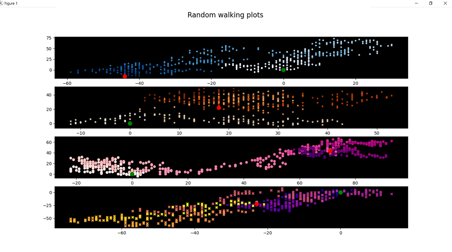

# random_points_plots

This is visualisation of the random walking. 
Random walk starts at the point (0, 0) that is marked as a big green dot on the plots. The random walk endpoint is marked as a big red dot.

Next point selection rule: 
Direction is randomly selected from values (1, -1) and multiplied by a randomly selected distance (from 0 to 4). When x and y points are calculated they are stored in the corresponding lists.

Based on the values of the above lists, charts are constructed.

Screenshot:

